# Aws autoscaling

# Launce a ec2 instance with public ip enable and security group enable all traffic from tcp

# Create image

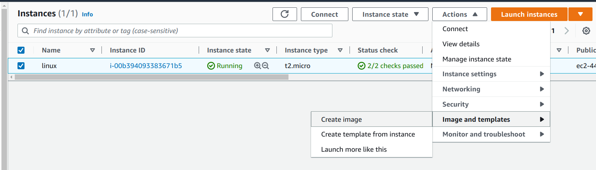
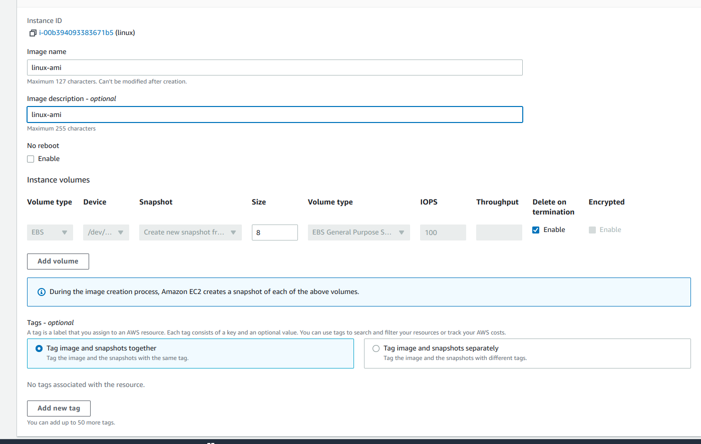

# Launce Configuration 

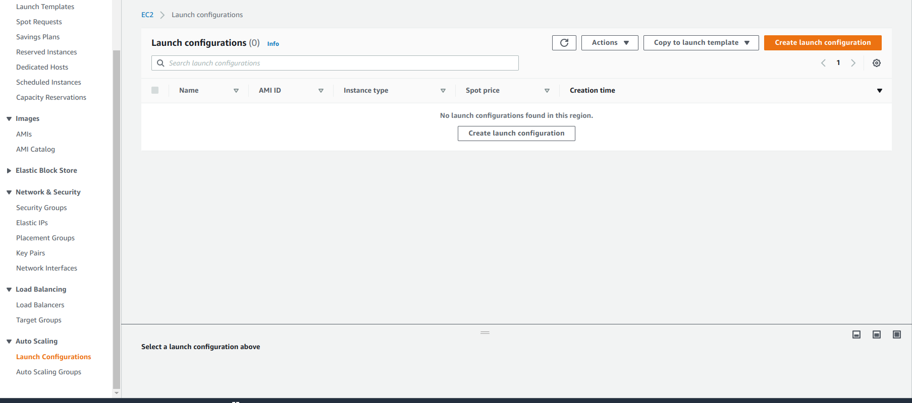
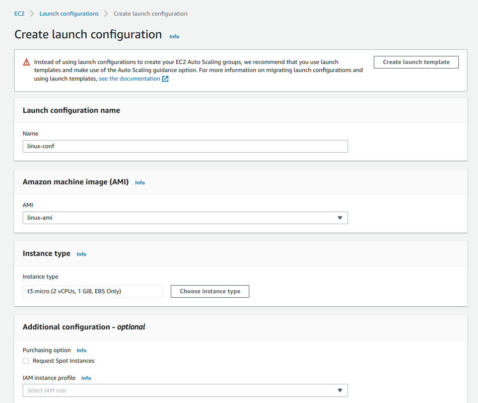
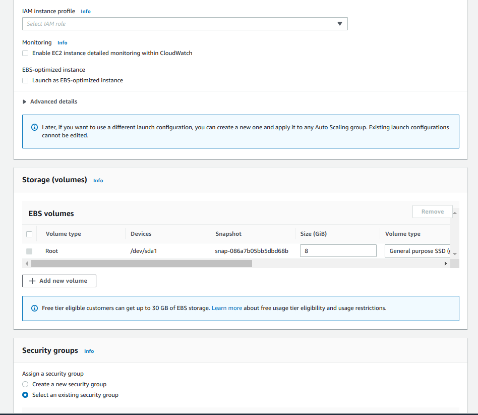
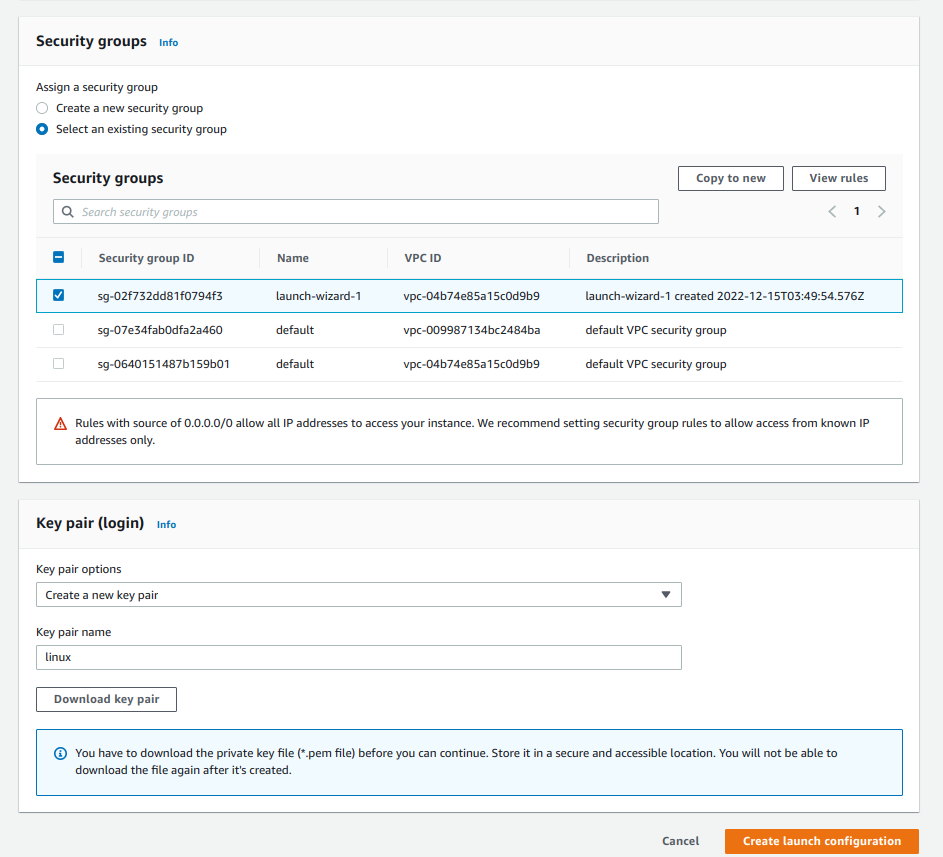

# Create auto scalling group

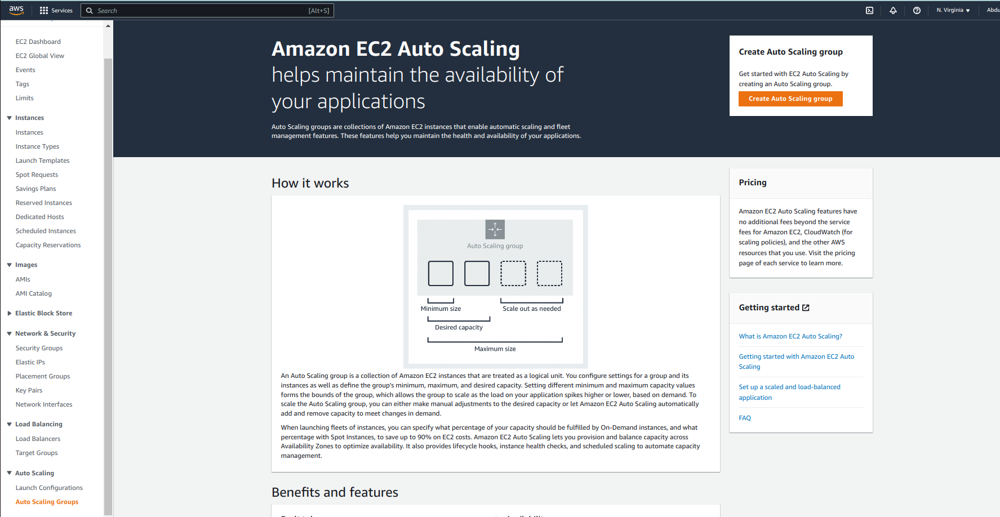
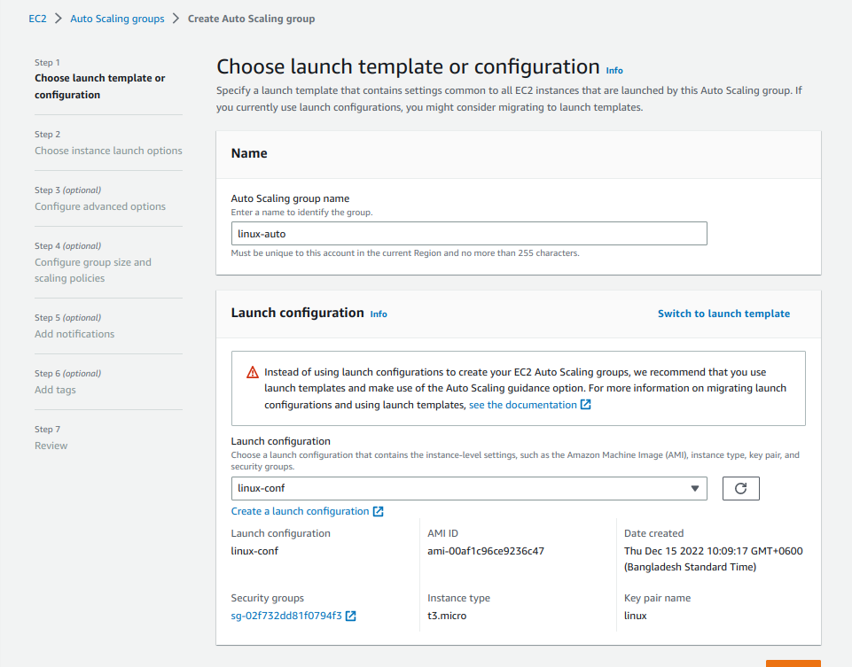
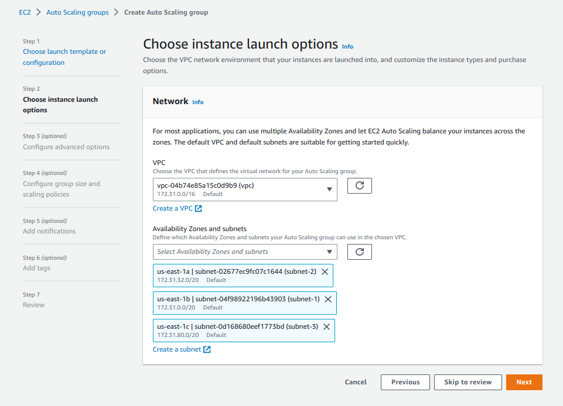
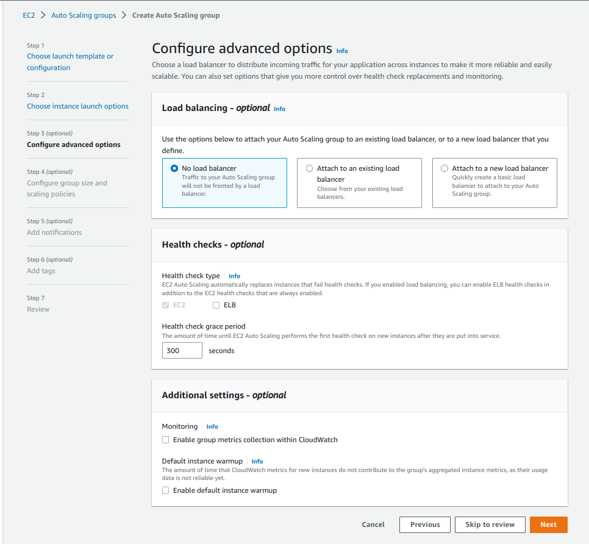
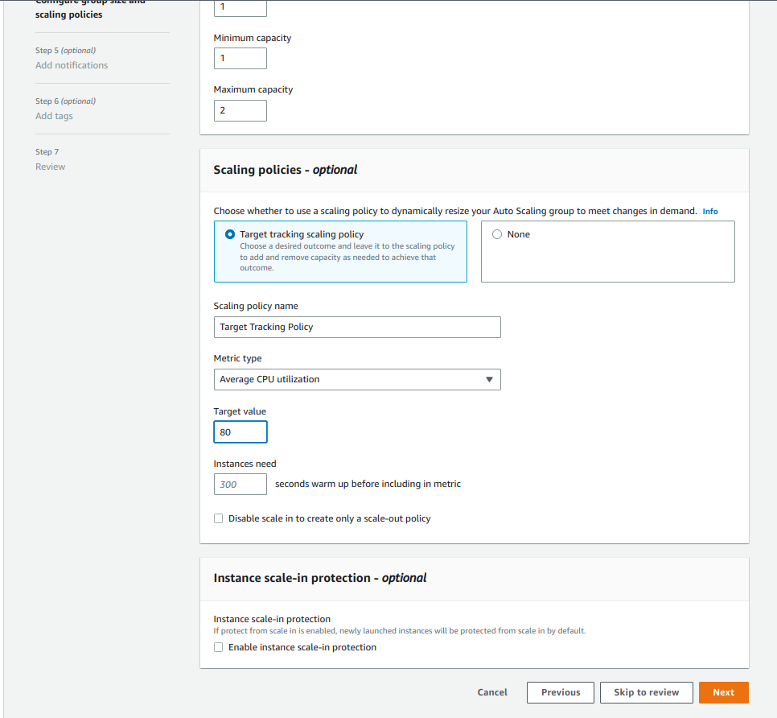
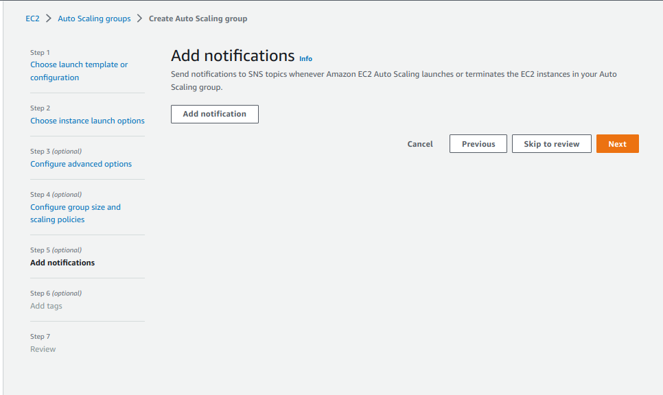
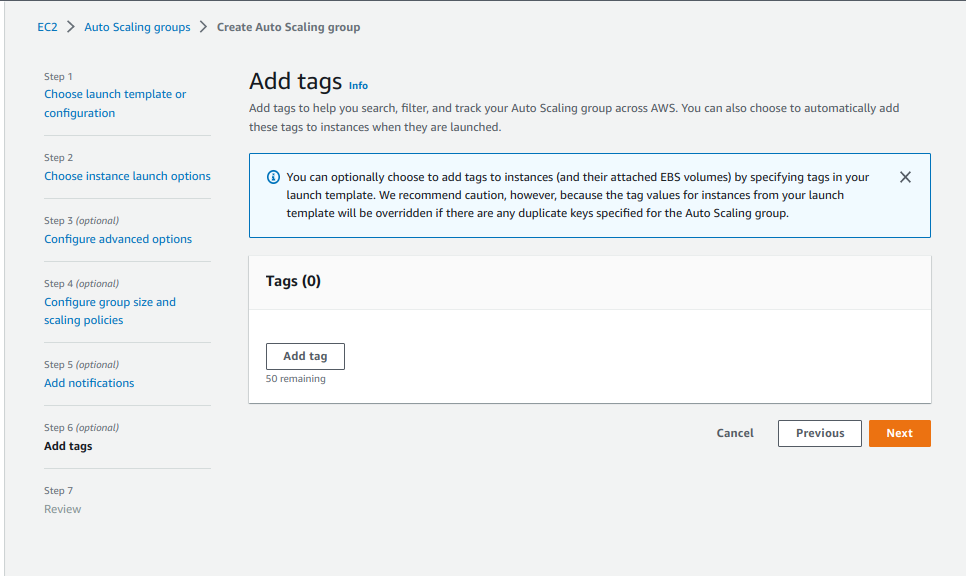

Now one server will be created after a while  

# Connect newly created server by ssh.

# Inrease cpu utilization

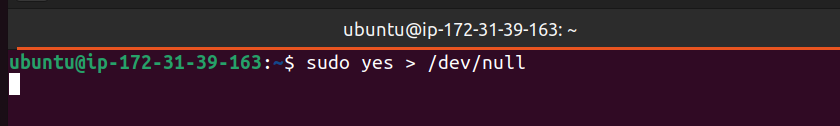

After  a while a new server will be created automatically

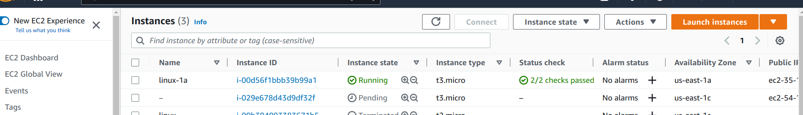